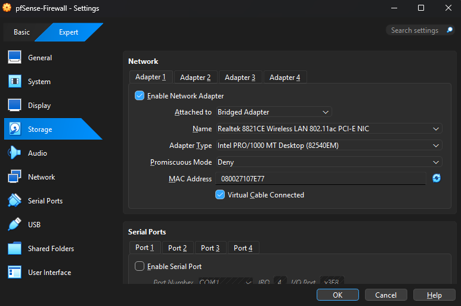
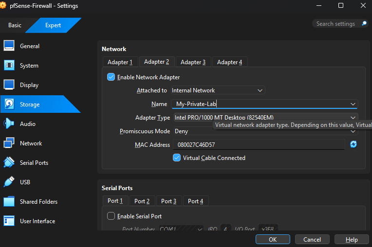

# 🔐 pfSense & Debian Secure Network Lab  
**Enterprise-Style Firewall, NAT & Headless Server Deployment**

---

## 📌 Project Overview
This project demonstrates a **realistic secured network environment** using **pfSense** as a stateful firewall and **Debian Linux** as an internal headless server.

The lab focuses on:
- Network isolation (WAN / LAN)
- Secure management without GUI
- NAT & Port Forwarding
- Firewall rule design
- Resource-efficient (CLI-only) systems
- Real troubleshooting scenarios

---

## 🎯 Engineering Objectives
✔ Build a segmented network  
✔ Secure internal services behind a firewall  
✔ Manage headless systems safely  
✔ Expose services **only when required**  
✔ Simulate real enterprise constraints  

---

## 🧱 Phase 1 — Systems Installation (References)
> OS installation screenshots are intentionally excluded to keep the repository focused on **network engineering**, not basic OS setup.

📚 **Official Installation Guides**:
- pfSense Installation  
  👉 https://docs.netgate.com/pfsense/en/latest/install/
- Debian Minimal Server Installation  
  👉 https://www.debian.org/releases/stable/installmanual

---
## 🐧 Debian Server — Nginx Installation

📚 For installation guide: [Official Debian Nginx Install](https://www.nginx.com/resources/wiki/start/topics/tutorials/install/)

### Verify Nginx is Running
```bash
sudo systemctl status nginx
```
📷 Screenshot:  
`Images/Linux_NginxCheck.png`

---

## 🧠 Phase 2 — Network Topology Design
The lab is designed with **strict traffic separation**.

### 🌐 Zones
- **WAN (External)**  
  VirtualBox **NAT Adapter** → Represents the Internet
- **LAN (Internal)**  
  VirtualBox **Internal Network (intnet)** → Fully isolated

📷 Diagram:  
`Images/Network-Topology-01.png`

### 🖥 Virtual Machines
| VM | Interfaces | Purpose |
|----|-----------|---------|
| pfSense | WAN + LAN | Firewall & Gateway |
| Debian | LAN only | Internal Server |

---

## ⚙️ Phase 3 — VirtualBox Network Configuration
### pfSense VM
- **Adapter 1 → NAT (WAN)**  
  

- **Adapter 2 → Internal Network (LAN)**  
  


📌 Result:  
Debian **cannot reach the Internet** unless pfSense allows it.

---

## 🚨 Phase 4 — The Headless Firewall Problem
Since:
- pfSense has **no GUI**
- Debian has **no GUI**
- Only Windows host has a GUI (Base System) 

👉 We face a **bootstrap problem**:
> “How do we access pfSense WebGUI if the firewall blocks everything?”

---

## 🛠 Phase 5 — Temporary Firewall Disable (Bootstrap)
To access the pfSense wizard **for the first time**, the firewall must be **temporarily disabled**.

### 🔧 Command (pfSense Console(Shell))
```bash
pfctl -d
```

📌 What this does:
- Disables packet filtering
- Allows unrestricted access
- **Temporary & controlled**
- Used only during initial setup

📷 Screenshot:  
`Images/Firewall-Troubleshooting.png`

---

## 🔁 Phase 6 — Port Forwarding (Management Access)
Since there is no GUI on pfSense, **VirtualBox Port Forwarding** is used.

📷 `Images/PortForwardingVB.png`

### 🔐 Forward 1 — pfSense WebGUI
| Setting | Value |
|------|------|
| Host Port | 8443 |
| Guest Port | 443 |
| Purpose | Access pfSense Dashboard |

Access URL:
```
https://127.0.0.1:8443
```
### Forward 2 — HTTP Service (Debian)
| External Port | Internal IP       | Internal Port | Protocol |
|---------------|-----------------|---------------|---------|
| 9090          | 192.168.1.101   | 80            | TCP     |

📌 Routes external requests from the Windows Host on port 9090 to the Debian web server (HTTP).

📷 Screenshot: `Images/PortForwardingVB.png`

---

## 🧭 Phase 7 — Accessing pfSense Dashboard
With firewall disabled + port forwarding:
- WebGUI becomes reachable
- Initial setup wizard completed
- Interfaces assigned (WAN / LAN)

📷 Dashboard:  
`Images/pfSense-Dashboard.png`

---

## 🧱 Phase 8 — Firewall Rules (Before Re-Enabling!)
⚠️ **Critical Step**  
Before enabling the firewall again, **permanent rules must exist**.

### 🔓 Rule 1 — Allow WebGUI Access  
Go to **pfSense WebGUI → Firewall → NAT and add the following:
- Interface: WAN
- Protocol: TCP
- Port: 443
- Source: Host
- Destination: pfSense

📌 This rule allows the Windows host to access the pfSense WebGUI server via `https://127.0.0.1:8443` while the firewall is enabled.
📷 Screenshot: `Images/NAT-Rule-HTTPS.png`

### 🔓 Rule 2 — Allow HTTP Access to Debian
Go to **pfSense WebGUI → Firewall → NAT** and add the following:

- Interface: WAN
- Protocol: TCP
- Port: 9090 (External)
- Destination: 192.168.1.101 (Debian VM)
- Destination Port: 80 (HTTP)
- Source: Windows Host

📌 This rule allows the Windows host to access the Debian web server via `http://127.0.0.1:9090/` while the firewall is enabled.
📷 Screenshot: `Images/NAT-Rule-HTTP.png`
---

## 🔒 Phase 9 — Firewall Re-Enable (Lockdown)
After rules are verified:

```bash
pfctl -e
```


---

## 🧪 Phase 10 — Validation: Accessing Nginx Services from Windows Host
📷 `Images/Final-Success-Result.png`

---

## 🧠 What This Project Proves
✅ Real firewall logic  
✅ Secure headless management  
✅ NAT & port forwarding mastery  
✅ Linux networking skills  
✅ Enterprise-style thinking  

---

## 👤 Author
**Obad Darwish**

